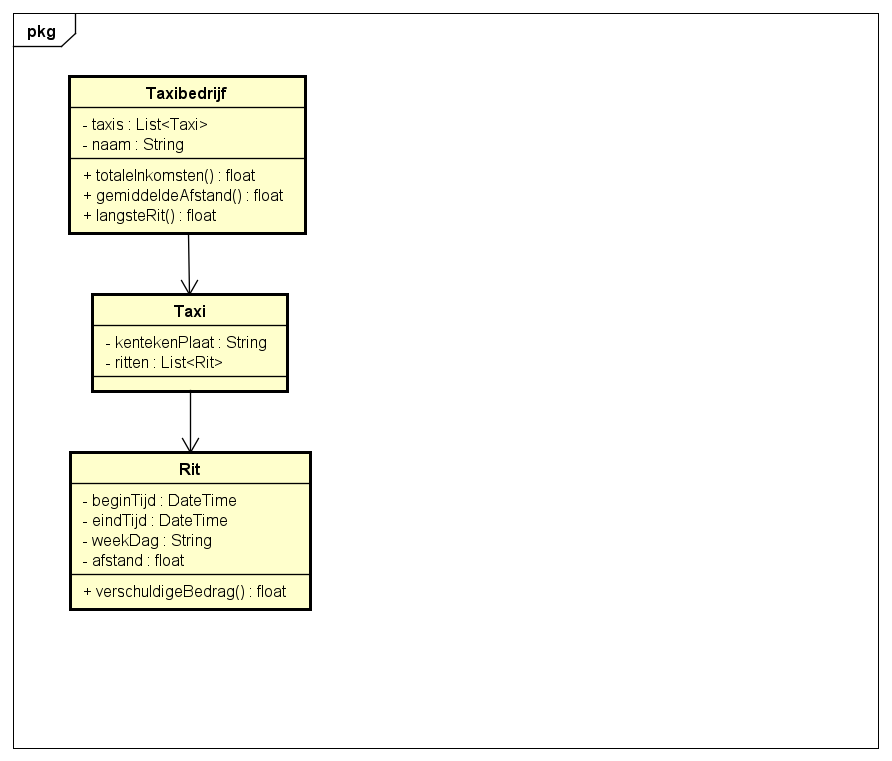

# Startdocument voor Taxikosten

Startdocument van Franca Baars. Studentnummer: 5005167

## Probleem Omschrijving

Een taxibedrijf heeft een aantal taxi’s. De volgende tarieven worden
gehanteerd: Per gereden km € 0,50. Daarboven per gereden minuut € 0,17.
Van vrijdagavond 22.00 uur tot maandagochtend 7.00 uur geldt een toeslag van 15% (het begintijdstip is hiervoor bepalend).
Er dient een programma te worden ontwikkeld waarmee voor iedere taxirit
de begin- en eindtijd (formaat hhmm), evenals de weekdag en de afstand
kunnen worden ingevoerd. Voor elke rit moet het verschuldigde bedrag
worden berekend en getoond. Verder moeten cumulatief de totale inkomsten, de gemiddelde afstand en de langste ritafstand worden getoond.

## Input & Output

In deze sectie worden de input en de output van de applicatie beschreven.

### Input

| Case     | Type | Conditions |
| ----------- | ----------- | ----------- |
| Naam van het taxibedrijf | String | niet leeg  |
| Kentekenplaat van de taxi | String | niet leeg |
| begintijd van de rit | DateTime | niet leeg |
| eindtijd van de rit | DateTime | niet leeg, later dan begintijd |
| De weekdag van de rit | String | niet leeg |
| De afstand | float | afstand > 0 |

### Output

| Case | Type |
| ----------- | ----------- |
| Het totale inkomen van het bedrijf | float |
| De gemiddelde afstand | float |
| De langste rit  | float |
| Het verschuldigde bedrag van de rit | float |

### Calculations

| Case | Calculations |
| ----------- | ----------- |
| Het totale inkomen van het bedrijf | Alle ritten bij elkaar opgeteld |
| De gemiddelde afstand | De totale afstand van de ritten delen door het aantal ritten. |
| Het verschuldigde bedrag | De afstand * de prijs van 1 km + de totale tijd * de tijd voor 1 minuut. |

## Klasse diagram

## Testplan

In deze sectie worden de testcases uitgelegd die nodig zijn om de applicatie te testen.

### Test Data

In de volgende tabellen zijn alle testgevgens die nodig zijn om te testen.

#### Gevangene

| ID | Input | Code |
| ----------- | ----------- | ----------- |
| Klaas  | Naam: Klaas datumMisdrijf: 13-07-2020 jarenStraf : 5    | new Gevangene(“Klaas”, “2020-07-13”, 5)  |
| Nynke  | Naam : Nynke datumMisdrijf : 20-07-2008 jarenStraf : 20 | new Gevangene(“Nynke”, “2008-07-20”, 20) |
| Piet | Naam : Piet datumMisdrijf : 05-04-2000 jarenStraf : -2  | new Gevangene(“Piet”, “2000-04-05”, -2)  |

**Cel**

| Id | Input | Code |
| ----------- | ----------- | ----------- |
| 1 | celNummer : 1 | newCel(1) |
| 5 | celNummer : 5 | newCel(5) |
| 0 | celNummer : 0 | newCel(0) |
| -2 | celNummer : -2 | newCel(-2) |

**Gevangenis**
| Id | Input | Code |
| ----------- | ----------- | ----------- |
| Guanta | naam: Guantanamo bay | new Gevangenis("Guantanamo bay") |

### Test Cases

In deze sectie worden de test cases beschreven. Elke test case moet worden uitgevoerd met de test data als beginpunt.

**1 Taxibedrijf een naam geven.**

Cellen toevoegen aan de gevangenis en kijken hoeveel vrije cellen er zijn in de gevangenis.
| Step | Input | Action | Expected output |
| ----------- | ----------- | ----------- | ----------- |
| 1 | Naam taxibedrijf: Bosman | Druk op submit | De naam is: Bosman |

**2 Informatie printen en kijken welke gevangen als eerste wordt vrijgelaten.**

Gevangene teoveogen en kijken of de informatie die geprint wordt klopt en kijken welke gevangene als eerste wordt vrijgelaten.

| Stap | Input | Action | Expected output |
| ----------- | ----------- | ----------- | ----------- |
| 1 | Guanta | printInformatie() |  |
| 2 | Guanta | eersteVrijlating() | null |
| 3 | 5 | voegGevangeneToe(Nynke) |  |
| 4 | Guanta | voegCelToe(5) |  |
| 5 | Guanta | printInformatie() | In Celnummer 5 zit gevangene Nynke en er is 1 vrije plek. |
| 6 | Guanta | eersteVrijlating() | Nynke |
| 7 | 5 | voegGevangeneToe(Piet) | De gevangene moet meer dan 0 jaar straf hebben. |
| 8 | Guanta | printInformatie() | In Celnummer 5 zit gevangene Nynke en er is 1 vrije plek. |
| 9 | Guanta | eersteVrijlating() | Nynke |
| 10 | 5 | voegGevangeToe(Klaas) |  |
| 11 | Guanta | printInformatie() | In celnummer 5 zitten de gevangenen Nynke, Klaas. |
| 12 | Guanta | eersteVrijlating() | Klaas |
